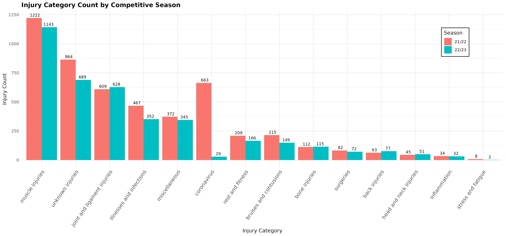
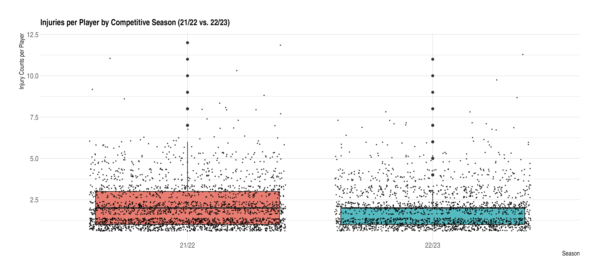
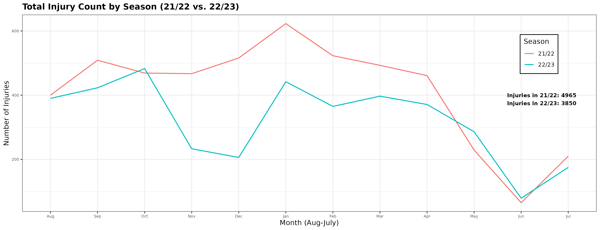
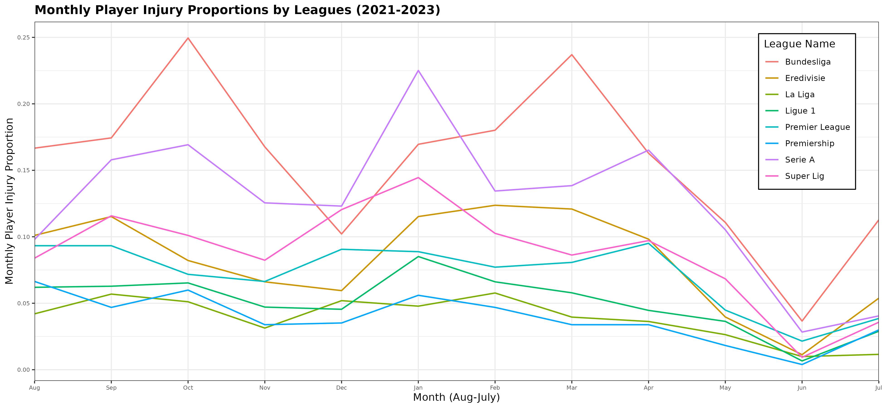
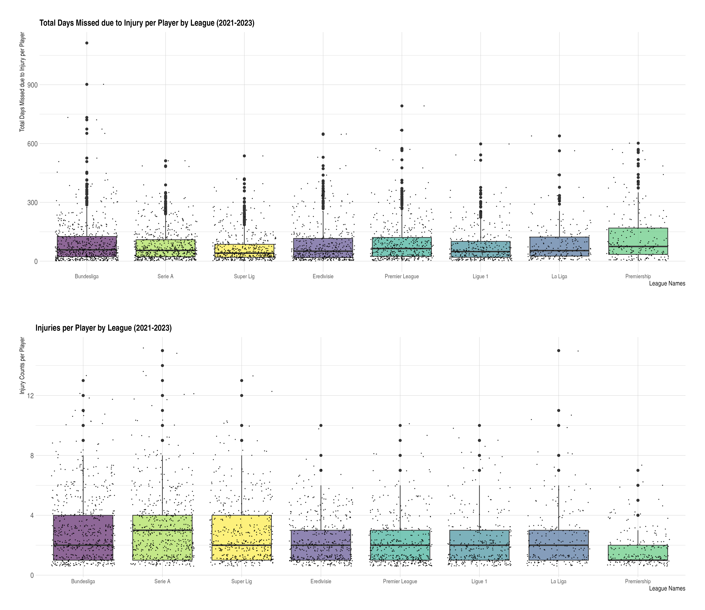
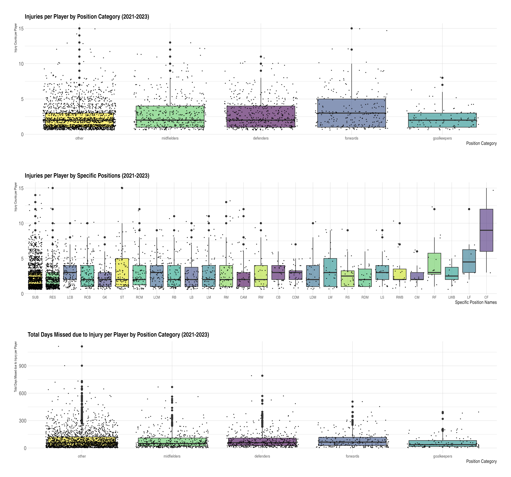
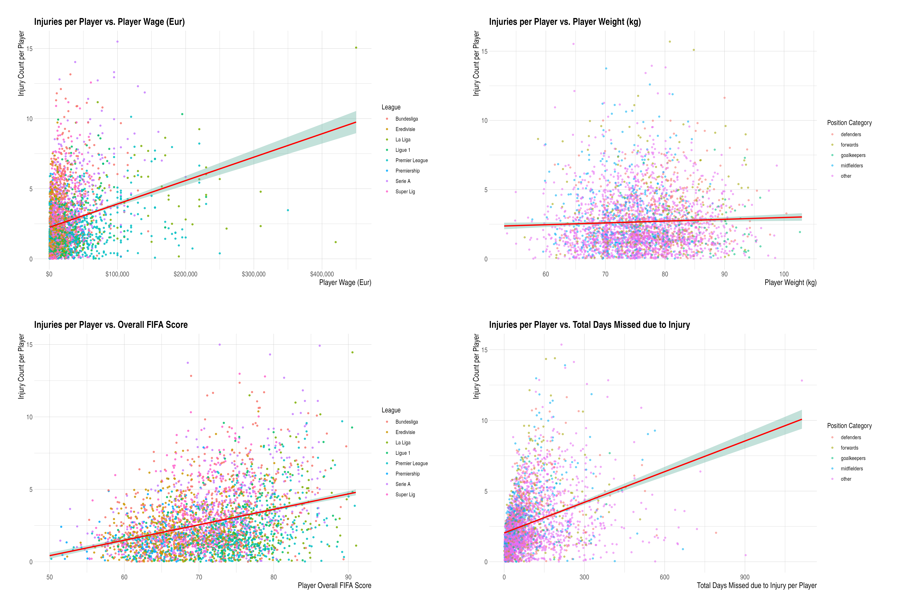
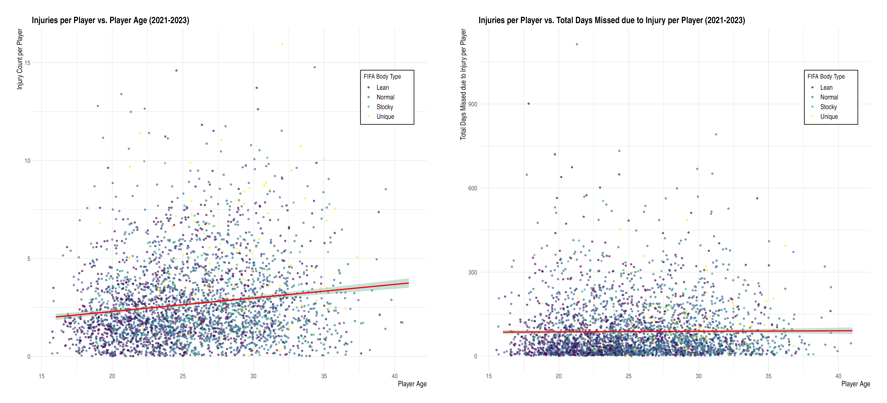
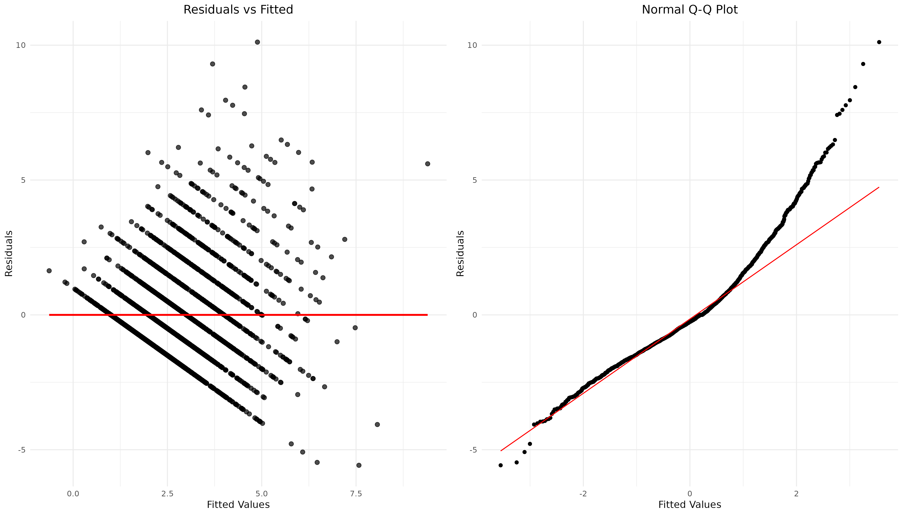

```{r setup, include=FALSE}
knitr::opts_chunk$set(echo = TRUE)
```


> **Introduction**


Professional competitive soccer leagues often have upwards of 40 games a season between the months of August and May. This count does not even include games that are played in various other competitions and tournaments, as well as games played for national teams. The demanding nature of professional soccer can increase injury risk for players as congested game schedules and reduced rest time take a toll on their bodies. In this project, I will analyze how various demographic and team factors impact injury frequency and severity. 

I only included eight professional soccer leagues in my analysis to make this project feasible. The eight leagues I included were: Bundesliga, Eredivisie, La Liga, Ligue 1, Serie A, English Premier League, Scottish Premiership, and Super Lig. These leagues host highly rated teams that often compete in various competitions, such as the UEFA Champions League, and are members of a diverse set of national teams. These non-league competitions in addition to league play can lead to increased injury counts, especially when teams continue to win in these competitions. 

One thing that I believe is important to note about my data is that the 2021-2022 season was impacted by the COVID-19 pandemic. Due to delays in game schedules attributed to the pandemic, clubs often had to reduce the rest time between games in order to finish the 21/22 season prior to the start of the 22/23 season. Furthermore, contracting COVID-19 may have impacted players' feelings of fatigue, leading to longer absences or the frequency of injuries sustained. 

Another important note to highlight is that the 2022-2023 season overlapped with the 2022 FIFA World Cup (November-December 2022) due to the location. Traditionally, the World Cup is held during the summer months, but since the competition was hosted in Qatar, the weather did not permit for players to play until the winter, causing the competition to interrupt regular league play. Players that were a part of national teams that competed in the World Cup played in additional games, underwent additional training, and underwent additional travel in order to partake in both national team and league competitions. Ultimately, I believe that this could have led to an increase in injuries sustained by players as they competed in more matches than they are typically used to in a singular season. 


> **Initial Exploratory Data Analysis**

After wrangling, cleaning, and merging my datasets, I created some descriptive charts to identify injury trends in the selected eight leagues. First, let's investigate the frequency of the types of injuries sustained per season. 





Muscle injuries were the most common injury among players during both seasons. Muscle injuries include strains, tears, and problems experienced by players in a muscle or muscle fiber. Muscle injuries are common among soccer players due to the explosive and quick nature of the sport. Additionally, the physical demand of a competitive season can lead to overuse and injury to the muscle, even when players engage in recovery tactics to mitigate these injuries. As expected, cases of Coronavirus were much higher during the 21/22 season, compared to the 22/23 season, as the 21/22 season took place closer to the height of the COVID-19 pandemic. The next highest injury count was joint and ligament injuries, which include injury or damage to, problems with, irritation of, or tears or ruptures to a ligament or joint. Joint and ligament injuries are common in soccer, therefore, I am not surprised to see it reflected in the data.
I think it is important to note that the total injury count for every injury category except for joint & ligament, bone injuries, back injuries, and head and neck injuries is higher for the 21/22 season compared to the 22/23 season. However, we do not know if this difference is significant or not, so let's run a t-test to compare. 


*T-test* 


```{r
total_injury_count <- data %>% group_by(season, month) %>% tally()

season21 <- total_injury_count %>% filter(season=="21/22") %>% select(n)
season22 <- total_injury_count %>% filter(season=="22/23") %>% select(n)

t.test(season21$n, season22$n)}
```


The t-test reports that the monthly average of injuries in the 21/22 season was 413.8 injuries, while the monthly average of injuries in the 22/23 season was 320.8 injuries. Additionally, the test indicated that **t = 1.58**, and the **p-value = 0.1289**, demonstrating that there is *not a significant difference* between monthly average of injuries per season at an alpha level of 0.05. 


Now that we have compared the total injury count for each season, let's compare the total injury count per player between each season. I have created a box plot to illustrate the injury count per player per season. 





The median number of injuries sustained by a single player in both the 21/22 and 22/23 season was 2 injuries, indicating that the central tendency for the number of injuries sustained per player within a season was the same each season. However, the middle 50% was higher for the 21/22 season. Now, let's look at some trends in injury frequency by month. 





When we look at the monthly trends for the total injury count by season, both season counts follow a similar pattern throughout the year. As the season starts in August, players get injured, but throughout the Fall season, injury counts drop. Then, during the winter months, there is a spike in injuries. I believe that this can partially be attributed to fixture congestion, as leagues often have clubs play multiple games per week during the months of December and January. Condensing team schedules reduces rest times between games and can increase the likelihood of injury. The injury count trails off towards April as most seasons come to an end, which is to be expected in the data. Now, let's compare this trend by league. 





When we look at monthly injury trends by league, the Bundesliga and Serie A have the highest proportion of players sustaining injuries over this 2-year period. A similar pattern to the total injury count line graph above can be seen in this graph. Some leagues such as Eredivisie, the Super Lig, the Premier League, and La Liga experienced at least a slight decrease in injury count in the Fall months. In the winter (December & January), all included leagues except for La Liga experienced a spike in injuries. Although this trend could partially be attributed to fixture congestion, I believe that this could be partially attributed to weather conditions as well. As expected, most league injuries begin to trail off starting in the month of April, reflecting the end of the season and league play.   


The monthly player injury proportion used in this line graph was calculated by dividing the total number of injuries sustained per month by the amount of players participating in each league; thus, demonstrating the proportion of injuries per player per league. I created this proportion to normalize the total injury count per league per month and reduce the impact that league size had on this data. Leagues with fewer players, such as the Scottish Premiership, were unfairly represented in this plot before creating this proportion.   


>
> **Exploratory Data Analysis: Box Plots**
>


I have created some box plots that will allow us to investigate and compare injury frequency and severity by competition league and player position. First, let's compare player injury counts and injury severity by leagues (I utilized total days missed due to injury as a proxy for injury severity, although I recognize that this is not a direct comparison).





The first graph displays the aggregate total days missed due to injury per player between the years 2021-2023 for each competitive league included in this analysis as a boxplot. I believe that total days missed due to injury may be used as an inferential proxy for injury severity. The median total days missed due to injury per player for each league was: 
Bundesliga = 58, Eredivisie = 51, La Liga = 54, Ligue 1 = 49, Premier League = 64.5, Scottish Premiership = 75, Serie A = 55, and Super Lig = 41. 
The Scottish Premiership and the Premier League had players with the highest total days missed due to injury, while the Super Lig and Ligue 1 had the lowest. 

The second graph displays the injury count per player between the years 2021-2023 for each of the eight included leagues. For the 2-year period, the median injury count per player was 2 injuries for the Bundesliga, Eredivisie, La Liga, Ligue 1, Premier League, and the Super Lig. The median injury count per player was 1 injury for the Scottish Premiership, and 3 for Serie A. It is interesting that the Scottish Premiership recorded the highest total days missed due to injury, but had the lowest number of injuries per player over the 2-year period. This may suggest a few things: injury severity is higher in the Scottish Premiership or injury recovery time is slower in the Scottish Premiership (due to a variety of reasons, one being resources/staff available), but this relationship should be investigated further. 

Now, let's conduct an Anova test to see if any of these leagues produced significant differences in injury count per players in this time period. 


*Anova & Tukey's HSD Test* 


```{r 
player_injury_leagues <- injuries_per_player %>% group_by(league_name) %>% select(injury_count)

league_anova <- aov(injury_count ~ league_name, data = player_injury_leagues)
summary(league_anova)
TukeyHSD(league_anova)}
```


The Anova test demonstrated that there is a significant difference between many of the leagues. I performed a Tukey's post hoc test to identify which league relationships were significantly different. Tukey's HSD test indicated that the following relationships were significantly different:

Super Lig vs. Scottish Premiership, Serie A vs. Scottish Premiership, Super Lig vs. Premier League, Serie A vs. Premier League, Super Lig vs. Ligue 1, Serie A vs. Ligue 1, Serie A vs. La Liga, Scottish Premiership vs. La Liga, Super Lig vs. Eredivisie, Serie A vs. Eredivisie, Scottish Premiership vs. Eredivisie, Socttish Premiership vs. Bundesliga, Premier League vs. Bundesliga, Ligue 1 vs. Bundesliga, La Liga vs. Bundesliga, and Eredivisie vs. Bundesliga. 

I believe this test demonstrated that the *majority of the leagues included in this analysis had a significantly different number of injuries sustained per player* over the 2-year period (2021-2023).


Now, let's compare injury frequency per player and severity by player position.





In the first two box plots above, I compared injury counts per player over the 2-year analysis period to player positions. The first box plot represents positions in broader categories that I created. The "other" position category is comprised of players that were marked as either reserves or substitutes as their main position in the FIFA dataset. The second box plot displays the same information by players *specific* positions indicated in the FIFA dataset. The third box plot highlights total days missed due to injury per player by their broader position categories. 

The second box plot indicates that players that play center forward have a central tendency that is much larger than most other specific positions. Additionally, left and right forwards have larger central tendencies compared to the other positions that are on the plot.

The first box plot indicates that the median injury count per player was 2 injuries for defenders, goalkeepers, midfielders, and others. The median injury count per player was 3 injuries for forwards during this 2-year period. The first two box plots indicate a similar message: players that play forward (which encompasses strikers, central forwards, and left/right forwards) sustained more injuries than other positions. However, let's conduct an Anova and post hoc test to see if these differences are statistically significant. 


*Anova & Tukey's HSD Test* 


```{r
player_injury_pos <- injuries_per_player %>% group_by(position_category) %>% select(injury_count)

position_anova <- aov(injury_count ~ position_category, data = player_injury_pos)
summary(position_anova)
TukeyHSD(position_anova)}
```


The Anova test & Tukey's HSD demonstrated that *all but 3 position category comparisons were significantly different*. The position categories that were not significantly different were: midfielders vs. defenders, midfielders vs. forwards, and others vs. goalkeepers. I believe that this test demonstrated that the majority of the position categories included in this analysis (including forwards) had a significantly different number of injuries sustained per player over the 2-year period (2021-2023).


>
> **Exploratory Data Analysis: Player Attributes**
>


I have created a few scatterplots to illustrate the relationship between certain player attributes, such as player wage, FIFA overall score, and weight, with injury count per player. Player wage represents a player's weekly pay in Euros. FIFA overall score represents a rating given to each player by FIFA based on various player statistics; the better a player is, the higher their overall score. For reference, highly paid and regarded players such as Lionel Messi or Cristiano Ronaldo have overall scores of around 91, while other players in the eight included leagues on average have an overall score that ranges from 65-80. Let's take a look at these scatterplots. The two scatterplots on the left represent injuries per player compared to FIFA overall and player wage, and are color-coded by league. 





There is a positive correlation that can be seen in both of the scatterplots on the left, indicating that there may be a relationship between injury count per player and their wage and their FIFA overall score. I anticipated to see this in the data as players that are better and are paid more are expected to play in more games and for longer minutes. The frequency of play for highly-paid players may reflect what we see in their injury counts. Another observation is that Premier League players seem to experience fewer injuries compared to players in  Serie A, the Super Lig, and Bundesliga. This observation may need to be investigated further, but a similar observation can be reflected in the box plot above that demonstrated that Serie A had the largest median of injuries per player compared to the other 7 leagues in this analysis. I believe that this league trend can also be seen in the scatterplot on the bottom left, as more Premier League players seem to be below the correlation line, while more Serie A and Bundesliga players are above it. 


Moving on to the scatterplot in the top right corner, we can see that there is not a relationship between injury count per player and player weight. I believe that this outcome reflects that the data is realistic, as I did not expect to see a correlation in either direction between weight and injury count. 
In the bottom right corner, there is a strong correlation between injury count per player and the total days missed due to injury. This relationship is expected as the more injuries a player sustains, the higher their days missed. I do not see a relationship between injury count and player position category, but am curious about how this plot would look if players were not classified as "others". In a future analysis, I hope to obtain each players position outside of being either a reserve or substitute. 


Now, let's look at the relationship player age has with injury frequency and severity. 





In the scatterplots above, I compared player age to injury count per player on the left, and player age to total days missed due to injury on the right. The plot on the left illustrates a slightly positive correlation between age and injury count, which I anticipated to see as when players get older, I would expect them to get injured more often. This plot is color-coded by player body type indicated by FIFA. I cannot make a definitive observation from this plot, only that players with lean body types seem to be gathered in an area for younger players with fewer injuries.

The plot on the right demonstrates that there is not a relationship between total days missed due to injury and player age. I would have expected there to be at least a slight positive relationship between the two variables as I anticipated that it may take older players longer to recover from injuries that they sustain, but that is not reflected in the data. I do not believe that a definitive statement can be made about player body type in this plot as well. 


Now that we have compared player attributes to injury type and severity, let's leverage machine learning to identify predictive relationships between attributes and injury count. 


>
> **Machine Learning: Predicting Injury Count Using a Linear Regression Model**
>


After my exploratory data analysis, I concluded that there may be some variables that are better at predicting injury count than others; thus, leading me to create a linear regression model to predict injury count per player and better understand the relationship of the variables included in my dataset. To quickly arrive at a final linear model, I performed a stepwise regression as my variable selection method. Stepwise regression is a statistical method for selecting predictive variables in a regression model by adding or removing predictors one step at a time based on their importance or contribution to the model.

The variables I deemed appropriate for predicting injury count given my exploratory data analyses included: age, preferred foot, work rate, nationality, body type, pace, league, FIFA overall score, player market value (Eur), player wage (EUR), club name, height (cm), weight (kg), specific position, and broad position category. Below are the Residual vs. Fitted Values plot and the Normal Q-Q plot to illustrate how well the model performed. 





The variables that the stepwise regression model selected to appropriately predict injury count per player include: **FIFA overall score, player wage (Eur), and club name**. The variable with the most significant relationship with injury count was FIFA overall score, followed by player wage, given that their p-values were significant/low. 


*Utilizing the Model*

I ran the linear regression model to predict the number of injuries to be sustained by Bukayo Saka (one of my favorite players) during this current 24/25 Premier League season. I provided the model with his current club team (Arsenal), wage (300,000 Euros per week), and his FIFA overall score (87). The model predicted that Bukayo Saka will sustain about 5 injuries within this 24/25 Premier League season. Realistically, this is not a poor prediction as he sustained 3 injuries during the 23/24 season, and is an integral player for both his club and national team (England). 

As can be seen from the plots above, this linear regression model does not perform well. Reasons for this could be that predicting injury count per player may not be a linear relationship, or that this combination of variables selected by the model does not best predict injury count. In the Q-Q plot in particular, there is a curvature on the tail ends of the plot, indicating a transformation of the dependent variable may be needed. Ultimately, this linear regression model does not thoroughly explain the linear relationship between player wage, age, and club name vs. injury count per player. 


>
> **Conclusion & Main Takeaways**
>


In this analysis, I utilized a three-pronged approach to understand and identify the relationships between injury count, player attribute data, and eight professional soccer leagues. First, I conducted exploratory data analysis to identify pertinent trends and correlations in the data. Then, I conducted statistical tests to highlight significant differences in my data. Lastly, I leveraged a machine learning algorithm to find the combination of variables that best predict/explain player injury counts. Here are some of my main takeaways from this project: 

* Player wage and FIFA overall score were significant predictors for injury count per player (club name was a good predictor as well, but did not produce a significant p-value)
* There was a positive relationship between injury count per player vs. total days missed due to injury, player wage, and FIFA overall score
* There was a significant difference in injuries sustained per player when comparing a majority of the leagues that were included in this analysis during the 21/22 and 22/23 seasons
* Muscle injuries, followed by joint and ligament injuries, were the most common injuries sustained during both the 21/22 and 22/23 season
* Although the injury count was higher for the 21/22 season, there was not a significant difference between the amount of injuries sustained when compared to the 22/23 season
* The proportion of players that sustain injuries per league spiked during the winter months (December & January) in all of the included leagues, except for La Liga


**Limitations** 

* Due to the format and syntax of the player names in both datasets, and the lack of a matching player ID column, all matching rows within the datasets were not able to be merged, leading to injury data being lost and not included in this analysis. This, in addition to not being able to normalize all of the injury counts likely means that this analysis may not be fully representative of injury trends and patterns in these eight competitive soccer leagues. 
* A linear regression model may not have been the appropriate model type to apply to this dataset and explain the relationship between injury count per player and other variables in this dataset.
* The FIFA dataset had various players listed as substitutes or reserves, meaning that we could not fully investigate how player position is related to injury frequency and severity.
* Many of the injuries in the injuries dataset were listed as "unknown" meaning that we could not fully understand injury types sustained by different players. 
* The injuries dataset was scraped from Transfermarkt, so it is likely that injuries that occurred may be missing from the dataset or were misclassified when they were reported. 


